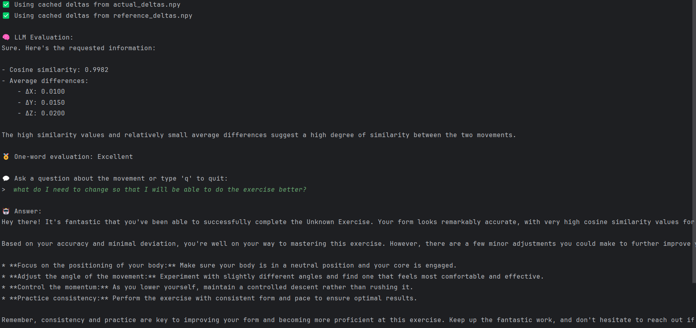

# 🏋️‍♂️ Movement Evaluation AI

A local AI assistant that analyzes and evaluates human movements using 3D coordinate data (X, Y, Z) from a sensor.  
It compares your movement to a reference example and gives feedback using a local LLM (`gemma:2b` via Ollama).

---

## 📌 Features

✅ Compares your movement to a reference with cosine similarity and delta analysis  
✅ Detects which moments your form was off  
✅ Friendly AI feedback powered by a local LLM  
✅ Works offline — no cloud, no internet needed  
✅ Supports real-time Q&A about your performance

---


## ⚙️ Requirements

Make sure the following are installed on your machine:

### 🔹 Python (3.10+)
Install from [https://www.python.org/downloads](https://www.python.org/downloads)

### 🔹 Ollama (for running local AI models)
Install from 👉 [https://ollama.com/download](https://ollama.com/download)

Then, run the following in your terminal:

```bash
ollama pull gemma:2b
```
---

## 🖥️ Demo Screenshot

